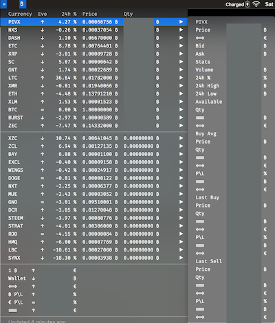

# Cryptobar
BitBar plugin which gives you some stats about your assets in [Bittrex](https://bittrex.com)



### Setup
- Install [Bitbar](https://github.com/matryer/bitbar/releases)
- Install [Fira Code](https://github.com/tonsky/FiraCode/releases) Font
```bash
$ git clone https://github.com/SushiFu/cryptobar.git
$ cd cryptobar
$ npm install

$ echo INIT_BTC=YOUR_INITIAL_BTC_INVEST > .env
$ echo INIT_EUR=YOUR_INITIAL_EUR_INVEST >> .env
$ echo BITTREX_API_KEY=YOUR_BITTREX_API_KEY >> .env
$ echo BITTREX_SECRET_KEY=YOUR_BITTREX_SECRET_KEY >> .env

$ mkdir -p ~/.bitbar/plugins
$ ln -s $PWD/cryptobar.js ~/.bitbar/plugins/cryptobar.10m.js # The `10m` in the filename is important because it say to BitBar what is the refresh rate, but you can put any value
$ defaults write com.matryer.BitBar pluginsDirectory "~/.bitbar/plugins"
```
- (Re)Start Bitbar

### LICENSE
MIT